:author: Marcel P Caraciolo
:email: marcel.caraciolo@einstein.br
:institution: Hospital Israelita Albert Einstein

:author: Juliano M Borges
:email: 	jmb2@cesar.org.br
:institution: Cesar School

-------------------------------------------------------------------------
Continuous Improvement For Clinical Bioinformatics Pipelines Development
-------------------------------------------------------------------------
.. class:: abstract

   How to successfully build a bioinformatics pipeline for clinical sequencing exams, consisting of collecting and refining requirements,
   interative software development, continuous testing and validation, and delivery, is the challenge faced by many bioinformatics development teams.
   Typical pipeline involves collecting and refining the requirements, translating into features, setting up an infrastructure, building a computation
   process, and analyzing the results. When the adjustments are made, this process repeates as many times as necessary until the pipeline has been properly
   validated. At Varstation, by using continous improvement techniques, we built a more efficient way to iterate on building those pipelines so we could optimize
   and deliver faster, but commited to providing accurate tests results. In this paper, we present our approach for design, build and deliver our
   pipelines after several changes in our software development process, which can be valuable for any bioinformatics teams interested in implementing with faster
   iterations clinical bioinformatics pipelines.

.. class:: keywords

   bioinformatics pipelines, project management, healthcare, clinical NGS, continous improvement, software development, continuous integration, continuous delivery, devops practices

Introduction
------------

Bioinformatics has become an important component in clinical laboratories generating, analyzing, maintaining, and interpreting data from molecular genetics testing :cite:`Gavin01`.
Given the rapid adoption of NGS-based clinical testing, service providers must develop informatics workflows that adhere to the rigor of clinical laboratory standards,
but flexible to changes as the chemistry and software for analyzing sequencing data mature. Next generation sequencing (NGS) is a transformative technology that is redefining the landscape
of human molecular genetic testing. It enables unprecedented parallelization of sequencing reactions, facilitating highly multiplexed testing paradigms with relatively rapid turnaround
time and decreasing costs. A growing number of diagnostic laboratories are embracing NGS and using it to drive new DNA-based test offerings, ranging in size and species, from human to
microbiome genomes and from multigene disease-specific panels to use of complete genome sequencing :cite:`Horner01`. When genetic tests are ordered, there is probably little thought as to all of the of bioinformatics work required
to make the test possible. The Hospital Israelita Albert Einstein provides diagnostic tests to help physicians understand risk profiles, diagnose medical conditions, or inform treatment decisions. To support their
comprehensive test menu and commitment to providing timely and accurate test results, the bioinformatics team focuses on optimizing their pipelines by designing workflows to leverage modularity and computational re-use, in order to
better understand the requirements for each molecular test; by using declarative workflow language as main programming tool to a more collaborative and legible code; by applying continous integration systems to the software development
in order to avoid manual validation, integration tests and releases; and by creating a collaborative repository of guidelines so any bioinformatician, beginner or experienced, at our team, can  begin build his first pipelines following the best practices.
All these improvements were conducted during three months by observing the bioinformatics pipeline development organization and applying changes in order to evaluate the gains in each step of the bioinformatics development lifecycle.

The purpose of this paper is to present an experience report in our bioinformatics team at Varstation (our bioinformatics department at the hospital), by providing a collection of experience notes, artifacts and systems that we introduced
and formalized during the period of reviewing our bioinformatics software development process. The detailed study results can be found in the remainder of the paper.
This paper is structured as follows. Section II introduces the background and related work that indicate the reason for our research. Section III introduces the research method
and process. Section IV presents the artifacts produced and related results. Section V discusses the implications to study results. Section VI concludes the study and illustrates the future work.

II. Background
--------------

This section reviews the concept of bioinformatics development lifecycle and related work conducted on our continous improvement research.

Bioinformatics pipeline development
===================================

With the advent of clinical sequencing , the bioinformatis pipelines for detection and variant annotation are becoming more popular. However, the process of translating the requirements of the biological and medical specialists is not a trivial task, adding to that,
the continuous development, testing and release, with improvements, the clinical pipelines. Compared to the traditional software development, the bioinformatics pipelines handles with biological inputs/outputs, runtime parameters and code itself, and  requires a continous
monitoring as the new versions from the dependant softwares are released or a need for a replacement of a new annotation biological database or even a new type of variant that must be detected  :cite:`Whiffin01`. In our scenario the bioinformatics pipeline must be reavaluated every time 
that a new genome version is updated or any refreshments in related databases. Developing a bioinformatics pipeline includes five steps from its conception to the final release in the production environment. At the figure :ref:`egfig` we depict the bioinformatics pipeline development lifecycle.

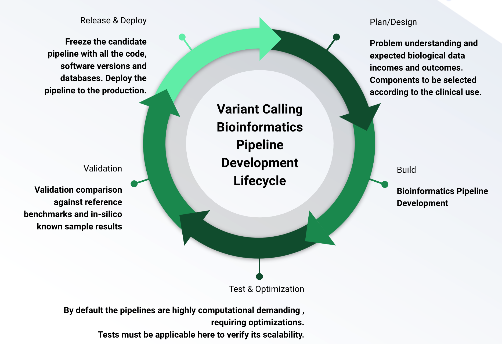

   The commom bioinformatics clinical pipeline development lifecycle. Each step in this workflow must be consolidated with the inputs/outputs mandatory for the following steps.  :label:`egfig` 

The analysis pipeline is typically considered to comprise the five main steps of plan/design, build, test/optimization, validation, and release/deploy :cite:`Koboldt01`. The planning includes the biological problem understanding and the selection of the components required to build the pipeline. The 
build stage leads to bioinformatics pipeline development including the coding, testing and code styles standardization. The test/optimization occurs when the pipeline is built successfully and it must be evaluated considering secondary requirements such as performance and scale.  
The validation may include the validation and benchmarking of the pipeline in order to guarantee the minimum defined performance metrics criteria. Finally, the release step is when the final artifacts must be delivered considering factors of versioning, docummentation and the executable
binary to be deployed in the production environment. This general framework varies depending on the precise analytical application, and successful clinical implementation of such work flows requires extensive expertise in bioinformatics and clinical regulatory issues.

Continuous Improvement
=======================

Continuous Improvement related topics have been studied by software engineering (SE) practitioners and researchers for many years :cite:`Birk01`. There are several related articles in blogs,
magazine, SE releated magazines :cite:`TechSpace`. Continuous Improvement identifies the opportunities to streamline the work while reducing waste. It follows the Japanese concept of kaizen, which means to make small incremental improvements continuously. It empowers the agile team so
they can work well together and discuss what is working and what isn’t. There are several empirical studies and practices of conducting continous improvement in software organizations :cite:`Birk01` :cite:`Brian01`. However, despite these practices have been examined by in many software industries, we failed
to identify any research conducted on healtchare and bioinformatics software organizations that are carrying continous improvement in practices.

Product Canvas: Building the pipelines with the right features
==============================================================

The goal of developing the product canvas has been to create a lean tool to develop successful product models in a framework that integrates user experience and feature development themes,
encourages innovation, and more closely represents the process as it occurs in practice :cite:`Roman01`.  Specifically, it combines Agile and UX by complementing user stories with personas, storyboards, scenarios, design sketches, and other UX artifacts.
The prototype version of the product canvas is shown in Figure :ref:`egfig2` below and is available online for developers and practitioners to test, evaluate, and provide feedback. In our scenario, this tool can be applied to prepare and gather the required 
information for the pipeline development phase as a product with a specific goal defined and the target genetic testing identified by the clinical specialists. From the laboratory need, it is also possible to derive the validation metrics and 
required acceptance criteria.

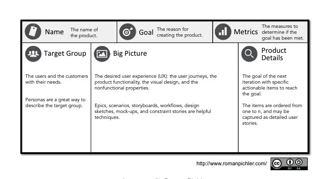

   The Product Canvas is a collaborative tool that combines Agile and UX by complementing user stories with personas, storyboards, scenarios, design sketches, and other UX artifacts. It helps the team
   to identify the target group, extract their needs and solve those needs with solutions, and finally package those solutions as tasks :cite:`Roman01`.  :label:`egfig2` 

Workflow Description Language for building pipelines
====================================================

One of the key challenges for bioinformatics pipelines is the rapidly increasing number and complexity of analytical methods. Reproducing the results of a bioinformatics workflow can be challenging given the number of components, each having its own
set of parameters, dependencies, supporting files, and installation requirements. Several platforms currently exist for the design and execution of complex pipelines. Unfortunately, current platforms
lack the necessary combination of parallelism, portability, flexibility, and/or reproducibility that are required by the current research environment :cite:`Leipzig01`. To address these shortcomings, workflow pipelines that provide
a platform to develop and share portable pipelines have recently arisen. Workflows descriptors such as Workflow Description Language (WDL) are hosted with containers to provide workflows scripts that can be reproducibly
executed on the cloud or local cluster :cite:`Larsonneur01`. In our team, we migrated our pipelines written in bash scripts to WDL to improve our pipeline development step and facilitate our bioinformaticians to rapidly start developing.

Continous integration
=======================

Continuous integration (CI) has been a de facto standard for building industrial-strength software :cite:`Duvall01`. Yet, there is little attention towards
applying CI to the development of bioinformatics applications until the very recent effort on the theoretical side :cite:`Spjuth01`. Continuous integration helps the development team to automate several steps of the pipeline development lifecycle such as
the test automation, the validation benchmark against a test sample, or the promotion of the release pipeline artfifact which can be used for upstream consumption in the production environment.

Figure :ref:`egfig3` presents an overview of the software development lifecycle under a traditicional CI system. The entire lifecycle consists of four stages: develop, build, test and merge. In advanced scenarios the CI workflow can also be added to 
a continous delivery (CD) when the release artifact is automatically released to the repository , or even further, to a continuous deployment, when in this case the artifact is deployed automatically to the production environment.

.. figure:: figure3.png
   :scale: 20%
   :figclass: bht

   The development lifecycle in the framework of traditional software development.  :label:`egfig3`

Development Playbooks
=====================

The bioinformatics team is a multidisciplinary group that may include developers, devops developers, designers , biologists and bioinformaticians who have different cultures, terminologies, and standards of proficience. Thus, in order to establish a productive collaboration and
effective development, the team must have the necessary tools, proper training and the best practices in mind, before starting building the pipelines. Development playbooks are intervention guidebooks that are created by, understood by, and acceptable to all members of the
multidisciplinary bioinformatices development team. These guidelines are created to aid the development of any software, so the beginners and the experienced members can use the same development principles and definitions shared to improve their target goal, which is the
delivery of a reproducible, tested and optimized pipeline. Development playbooks are very popular among several mature software companies that are evolving their software development skills :cite:`Filipe01` :cite:`Thomas01`.

III. Research Method
--------------------

We conducted our continous improvement process in four stages: (1) observation, (2) planning, (3) execution, (4) review . It is based on the Plan-Do-Check-Act (PDCA) cycle :cite:`Erivan01` :cite:`Ning01`. Each stage is described in the following sub-sections.

A. Observation
===============

We reviewed the current bioinformatics variant calling pipeline development process and discussed with the team members the pain points for each stage. All these interviews and meetings during the retrospective and daily meetings at the scrum cerimonies helped us to gather
data to perform some initatives and modifications in the process.

B. Planning
===========

With the experience notes, the team reflection reports, and the software production snapshot data carried from the first step, we analysed all those material and identified some improvements that could be performed at our process. 
Each improvement was first discussed with the team, since the implementation of some these adjustments needed a timebox in their current product development sprints. These materials were transformed in user stories or epics in our 
backlog so we could implement and test them throhgh the sprint.

C. Execution
============

The user stories were put into the sprint backlog accordingly to the slots available negotiated with the product owner and the development team. Some changes were just improvements in docummentation,
others just an automation in a specific development build stage (using CIs for instance). The team was commited to perform these changes since it would bring already new experiences and learnings about our current process.

D. Review
==========

This is the last stage, where we collected the feedback about the improvements after the improvements, and made new adjustments as we decided to refine it, or sometimes since it could be a complex task, delay it for a future iteration.
The review technique also helped us to identify inneficiencies to eliminate, positive things to enhance and new opportunities to improve.

IV. Current Results
-------------------

In this section we provide some of the current results and the artifacts produced during the period of three months (from August 2021 until October 2021) as we started the study method presented in the section above.

A. Design and Planning
======================

Our bioinformatics team, through the years, was delivering bioinformatics pipelines for many omics: transcriptome, genomics and metagenomics. For each one there is a common toolset for the pipeline building development. It is up to the bioinformatician to analyze the biological
problem that will be solved, define the tools and algorithms available for each variant calling step from the DNA digital sequences to the genomic variants and build an automated pipeline that perform all these tasks using the computational resources. During the design and Planning
stage our team discuss with our clients (medical specialists and biologists) to have a common and clear understanding about the main requirements for the pipeline that will be associated to a research project or a novel genetic test available for our patients. Inspired by the 
Product Canvas , explained at our background section, we proposed and created a Bioinformatics Pipeline Canvas (BPC)  [#]_.  Our canvas is a collaborative tool that includes Agile , scientific methdology, adapted to facilitate the technical discussions between our bioinformaticians, biologist
and geneticists. The main goal is to have an overall picture to model the pipeline. We will use it as a validation method for checking all the requirements to have a pipeline implemented: Which are the inputs/outs expected for each step of the pipeline, the tools required for
each pipeline component (task) and the performance criteria that will be considered before being released to a production environment.

At the figure :ref:`egfig4` , we show an example of a full-filled canvas in one of our internal trainings. The artifact is available as open-source template at the miro.com [#]_.

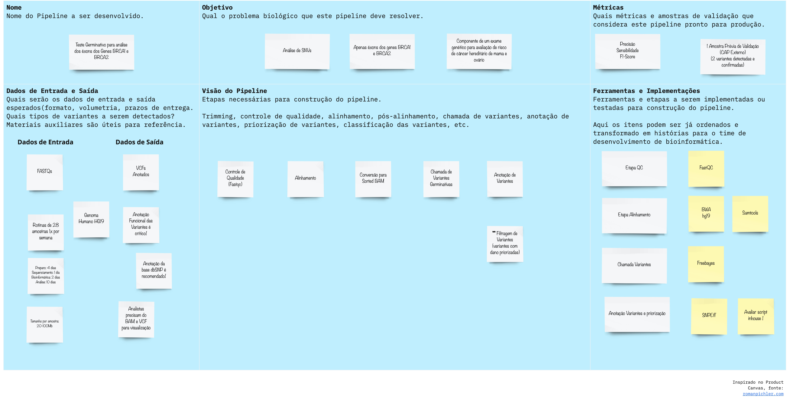

   Our Bioinformatics Pipeline Canvas, inspired by the Product Canvas as a visual tool for our developers and product owners to facilitate and translate the clinical and biological requirements into features, expected inputs and outputs and
   performance metrics criteria.  :label:`egfig4` 

.. [#] Bionformatics Pipeline Canvas available at miro.com, https://miro.com/app/board/o9J_lyF0HrA=/.
.. [#] Bioinformatics Pipeline Canvas example at miro.com , https://miro.com/app/board/o9J_lyFSWQc=/

B. Development
==============

One of the improvements at our development cycle was to rethink how we managed and orchestrated our current variant calling bioinformatics pipelines. The changing landscape of genomics research and clinical practice
has created a need for computational pipelines capable of efficiently orchestrating complex analysis stages while handling large volumes of data across heterogeneous computational environments. Our current pipelines
were monolytical with shared command line bash scripts with python/perl/R code invoked. The main issue in this approach is that it is difficult to identify/debug problems, it doesn't enable a rapid escalation and
doesn't promote the modularity within the pipelines. Since 2020 we started to discuss novel tools and bioinformatics worfklow programming languages to help us to mitigate these problems.

After several proof-of-concept tests (POCs) and discussions we came to workflow tools, such as WDL (Workflow Description Language), that makes pipelines easier to express and build. With WDL, you can easily describe the module dependencies and track version changes to the workflow.
Our team reorganized the pipelines and broke the code within them into smaller modules in WDL, so our future pipelines could benefit of the components implemented just plugging it into the main WDL workflow, and just modify the corresponding
input files By reusing the tasks , developers can dramatically speed the development of new workflows. The figures :ref:`egfig5` and :ref:`egfig6` presents the architecture overview of bioinformatics workflow written in modules and
the WDL declarative syntax and style code, respectively.

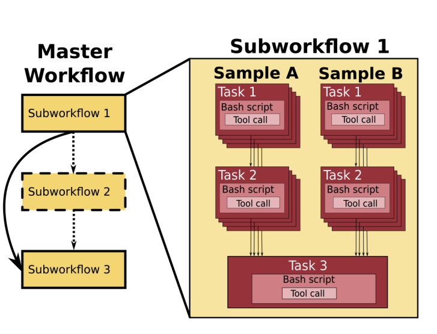

   Bioinformatics workflows written with WDL in multiple levels of complexity warrant a modular construction. It is easiest to program the workflow when its logic is abstracted away (in Tasks, red)
   from the command line invocations (in Bash scripts, pink) of the bioinformatics tools (light pink). Individual workflows can be further used as subworkflows of a larger Master
   workflow. :label:`egfig5`

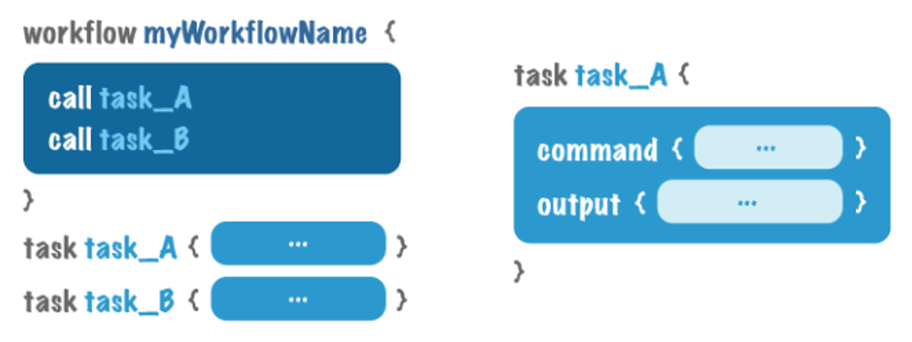

   Example of an workflow skeleton. We define the inputs and corresponding outputs, each one declared as variables. We also define the tasks, which it will be computational blocks that will execute the pipeline commands.
   These tasks are invoked from the main workflow using the call methods. :label:`egfig6`

The team also changed the orchestration tool from using AWS Lambda tasks to a open source bioinformatics tool developed by the Broad Institute of Harvard University and MIT called Cromwell [#]_ :cite:`Voss01`.
It is a workflow-execution engine that simplifies the orchestration of computing tasks needed for genomic analysis. With the infra-structure and devops team working together, we led to Cromwell
being able to run directly on an Amazon Web Services (AWS, cloud-computing) environment [#]_. This has given our bioinformatician more flexibility in scaling their genomic workflows.
For instance, our whole human genome variant calling Pipeline is using Cromwell to automate and enhance its quality control capabilities in our analysis software Varstation [#]_. Figure :ref:`egfig7` presents
the AWS proposed architecture for running Cromwell using the AWS Batch environment :cite:`Schreiber01`.

.. [#] Cromwell execution engine available at Github, https://github.com/broadinstitute/cromwell.
.. [#] Amazon Web Services cloud-computing,  https://aws.amazon.com/pt/.
.. [#] Varstation bioinformatics cloud-service, https://varsomics.com/varstation/

.. figure:: figure7.png

   Cromwell is a workflow management system for scientific workflows developed by the Broad Institute and supports job execution using AWS Batch. :label:`egfig7`

Finally, one of the improvements for building new bioinformatics pipelines was propose a minimal base template for our developers getting started following our best practices and guidelines. Several CI scripts, version control management,
docummentation build scripts and automated workflow test suite integrated were compiled into this repository. It is a basic start pipeline so from begginners to advanced users can use it right away. At the time of writing this paper, we
were still validating the framework by migrating our old pipelines to WDL based on it. The figure :ref:`egfig8` shows the repository of our minimal pipeline template hosted as a template repository on Github [#]_.

.. [#] Our minimal pipeline template on Github repository, https://github.com/Varstation/pipeline-template

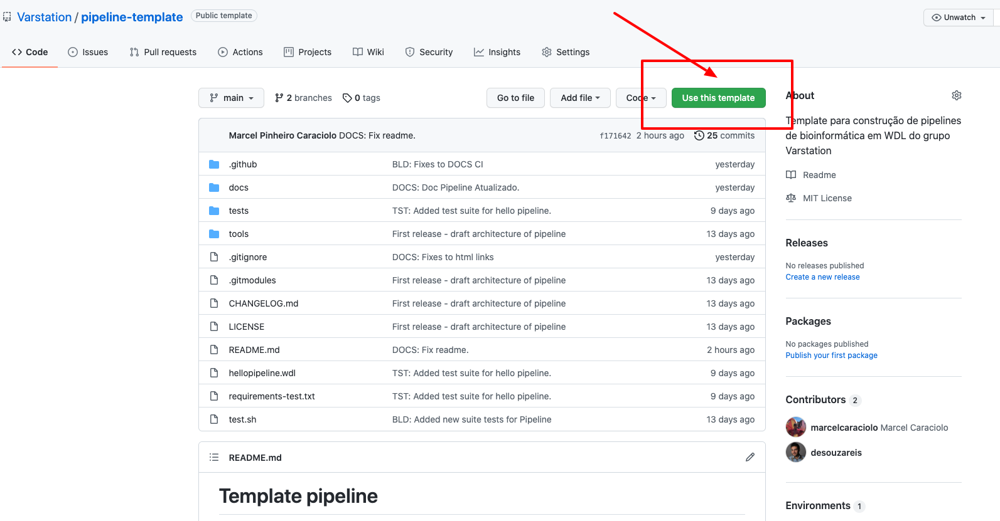

   Our minimal pipeline template was hosted in Github as a pipeline repository so the developers can easily fork all the code to their new pipeline repository. :label:`egfig8`

C. Build, test  and optimization
=================================

In this stage, our team draw our inspiration from continous integration (CI), which has been part of the industry standard of modern development. CI services lift the burden of managing
the software development lifecycle from the developers by providing a variety of tools for building and testing software applications in an automated and iterative manner. Development of 
bioinformatic pipelines is not much different in this regard from regular software systems - it typically mandates many interations as developers try to continuously improve the quality
of their workflows as new software versions are released or new variant annotation datases are published.

Before the CI, our tests were manually handled and all the builds were performed manually when the developers remembered to perform it. This caused to many refactories and hidden bugs that
weren't easily manageable. There was also any code validation following WDL code style best practices, as more members started to push their code into the repositories, specially, the tasks modules,
it brought to our attention the fact the changes in some module could affect many dependant pipelines. Figure :ref:`egfig9` presents an overview of the bioinformatics development lifecycle
under our CI system. Like the development of regular software, the entire lifecycle consists of four stages (akin to a GitHub or Azure DevOps kind of development scenario):

- **Develop** – the developer writes code for the variant calling pipeline, reusing when appropriate the existing task modules, as well as basic parameter collection.

- **Build** – the developer requests merging the code into the main branch (a.k.a., a pull request); this automatically triggers the build process of the codebase, which validates the code style (linting), run the appropriate tests with small data samples as parameters to validate if all expected outputs are produced.

- **Validation** - The validation phase follows if the build process succeeds; the final pipeline is evaluated against the benchmark datataset, after which the test performance metrics is reported to the developer.

- **Release**  - if all the testes cases are passed and the developer is satisfied with the accuracy and metrics, the pipeline can then be promoted to a release environment for upstream consumption, potentially replacing the old versioned pipeline that was already released.

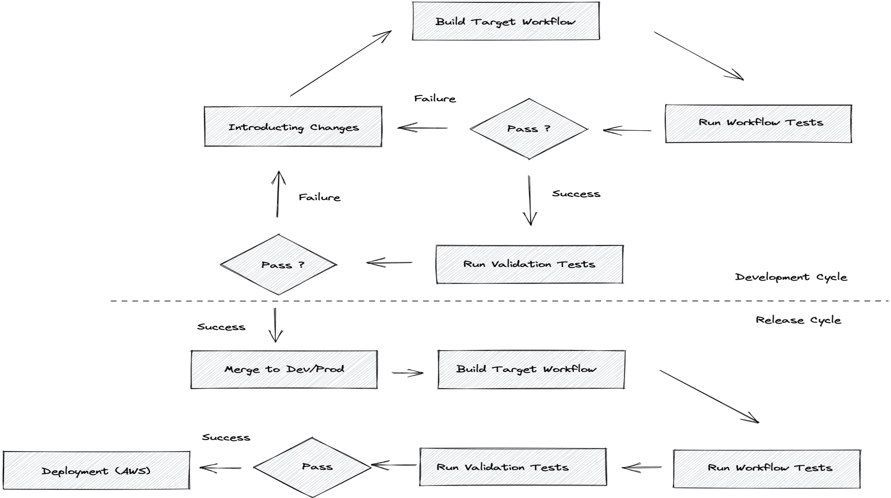

   The development and release lifecycle of a bioinformatics pipeline in our software development process. :label:`egfig9`

Our first CI system was implemented and tested with some test pipelines. As illustrated in Figure :ref:`egfig10`, we implemented it using
Github Actions [#]_ and we integrated some auxiliar tools for testing, packaging and verifying code in the process. One example was writting 
tests for the pipeline and guarantee the correct and expected outputs. We used the open-source tool Pytest-workflow [#]_ that make testing as simple as possible,
by testing a WDL pipeline run through Cromwell. The CI runs the test-suite available with the sample data and verifies the cromwell log outputs in seek of any errors found
during the execution.

.. [#] Github Actions, https://github.com/features/actions
.. [#] Pytest-workflow workflow test-automation tool, https://pytest-workflow.readthedocs.io/en/stable/

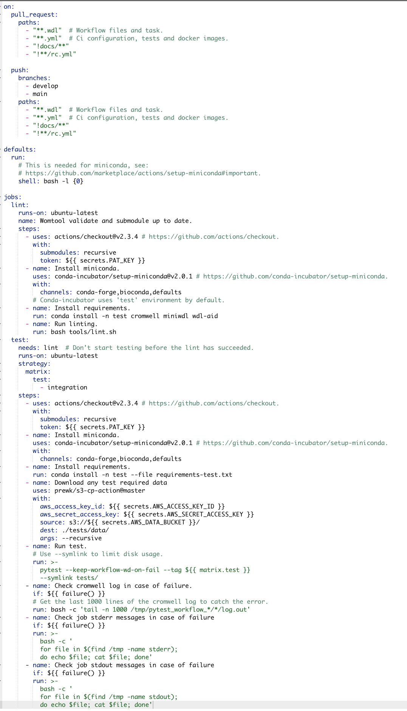

   Our build continous integration script for the tasks of validating the code and running tests. :label:`egfig10`

D. Validation
=============

All clinical bioinformatics systems require that primary, secondary, and tertiary analytical components be properly documented and validated.
Accreditation requirements also state that bioinformatics pipelines must be validated and performance criteria clearly defined. This should include determination of variant calling sensitivity,
specificity, accuracy, and precision for all variant types reported by the clinical assay :cite:`Jennings01`.

Our benchmarking strategy to meet these requirements was to evaluate the performance using a set of reference samples with a large number of gold-standard variant calls and
clinical samples with a a small number of clinical variants that are specific to the diagnostic assay being evaluated. We developed a benchmarking pipeline (vcf comparison framework)
which accepts input and truth set variant call files and regions of interest files to calculate the performance metrics across the entire region of interest.  Before the continous improvement
process, our benchmark workflow was performed manually using bash scripts and terminal commandlines. Then, we ported our benchmarking modules to WDL format to use pipeline execution engines
such as Cromwell, using our computer-infrastructure at Amazon WebServices. We also integrated with deployment tool, such as Github Actions, a feature that could automate our benchmarking workflows
when any pipeline was released a new candidate version.

The figure :ref:`egfig11` presents a schematic diagram of the benchmark framework used in this study. The benchmarking workflow written in WDL format consistes of five main steps in which the software tool employed
in each step is indicated within parentheses.

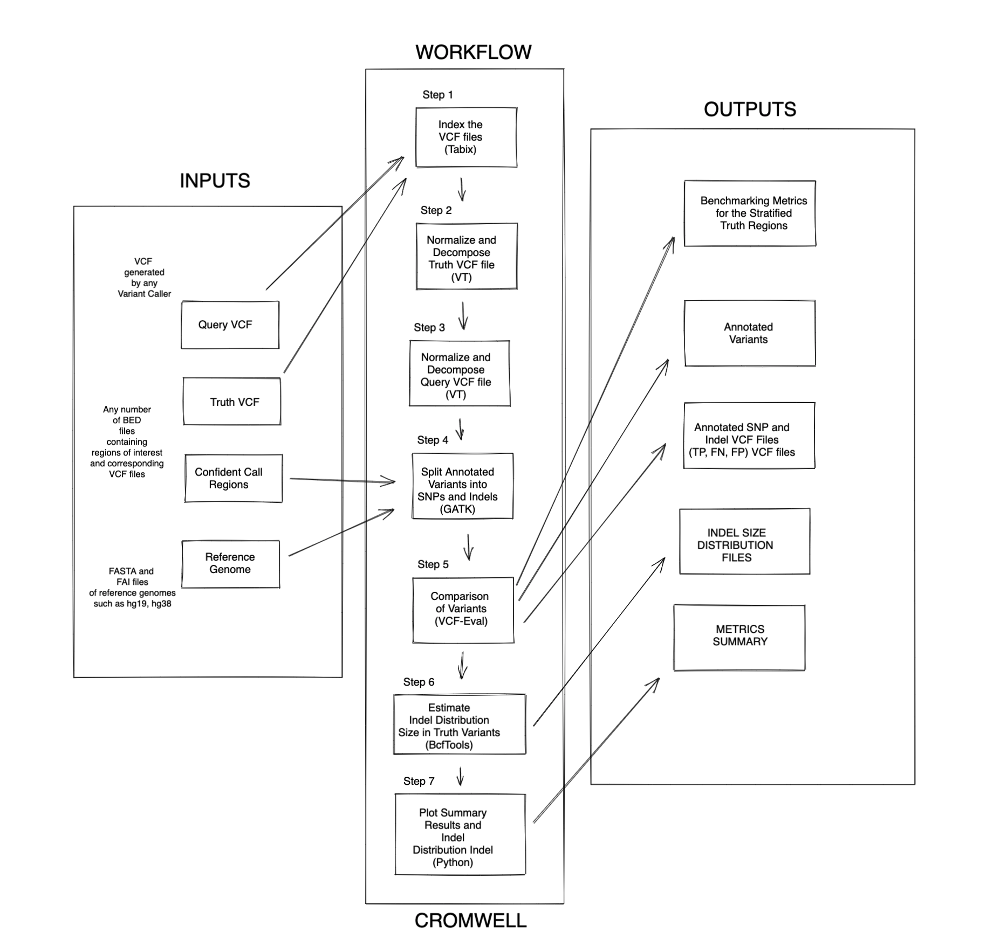

   Our Benchmark reference implementation of a validation framework. :label:`egfig11`

E. Release and deploy
=====================

Our release stage was also modified in order to enable an automated manner to perform the deployment of the release artifacts with version control, pipeline docummentation and release notes. Before we deployed versions manually but without concise release notes
or a controlled version control common to our all bioinformatic pipeline. Moreover, we didn't have an offical place to put our release files. We  integrated with our continous integration tool in order that every new 
tag pushed to the Github (a new version published), the CI starts to verify all the WDL files, package it into a binary (zip file) and makes it available as release package at the pipeline's repository [#]_. 
The docummentation is also published to the Github Pages as a single page for each pipeline [#]_. With this improvement, our Releases became
available for other teams to download and use it, and can receive notifications when they are published. Figure :ref:`egfig12` presents the released pipeline packaged contaning the releases notes and the corresponding assets.

.. [#] Example of our CI script for packaging and releasing our bioinformatics pipelines, Available at https://gist.github.com/marcelcaraciolo/4bae60a66f9ae9a68c27a4102eb8769c
.. [#] Example of our pipeline docummentation, Available at https://varstation.github.io/pipeline-template/0.1.0/index.html

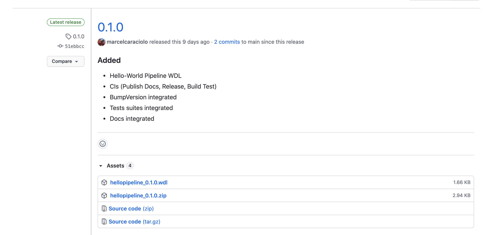

   Releases Page of one our pipeline's repository on Github. Now all the pipelines follows our best practices by using our CI tools available at our minimal pipeline template. :label:`egfig12`

F. Docummentation
=================

Our experience working with a multidisciplinary team of developers and bioinformaticians with different background in the creation of a bioinformatics pipeline exposed a significant challenge. 
Through our process of continous improvement, we decided to address this challenge and improve the collaboration and the on-boarding of the new members to our team by creating a 
of best practices guidelines, containing examples about how creating the pipelines, and detailing each step from our variant calling pipeline lifecycle development. At the time of writing of this paper,
the first draft of our bioinformatics development playbook was available and acommodated several guidelines and manuals from the design to the deployment of a pipeline. The docummentation is hosted on-line
and its code is all on a Github repository, so anyone at the team can collaborate by adding or changing the content as a dynamic docummentation [#]_. The figure :ref:`egfig13`  presents one of the screenshots of our bioinformatics playbook.
All the code is based on the open-source media wiki tool Docusaurus [#]_.

.. [#] Our bioinformatics playbook, Available at https://varstation.github.io/bioinfo-playbook/
.. [#] Docusaurus platform, Available at https://docusaurus.io/

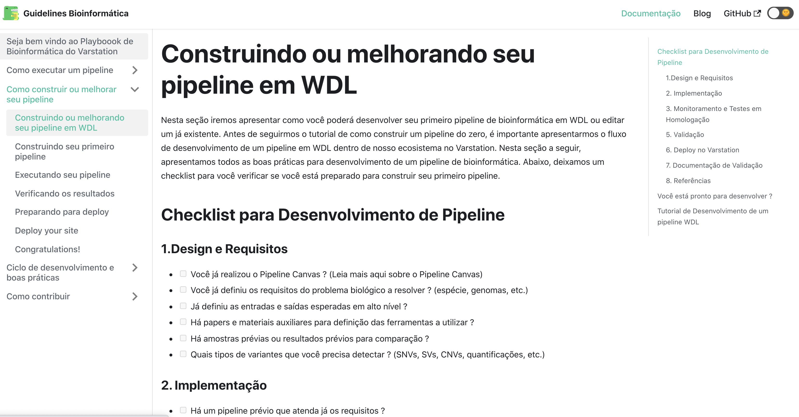

   One of the sections of our bioinformatics playbook on-line. The content is written in Markdown and all the source code is availaibe on our Github repository. Anyone in the team is invited to collaborate. :label:`egfig13`

V. Discussion
--------------

In this section we carry out the discussion on our continous improvement proccess and
explain our preliminary perceived succes factors after applying it through three months.

A. Perceived success factors
============================

In this study, we present a set of key results presented at the section Results after applying the PDCA continous improvement methodology. An emphasis was put on 
the incremental approach to improve our bioinformatics pipeline development workflow and its process. Since the initial phase of our study, there was no documented
test automation strategy, our requirements collection tools was not mature, there wasn't any code writing standards and several delays on start using the new execution
engine for our pipelines using WDL and Cromwell. Indeed, all these problems was dicovered step by step in practices. Our team continuously explored their needs and possibilities
for each of one of our development stages. The direction of our improvement process was discussed in our informal meetings during the retrospective and planning sprint cerimonies.

Accordingly, the actionable steps were took to make the meaningful changes. We didn't change the whole process, therefore, the changes were always added incrementally piece by piece
with some testing pipelines into the existing development process. Some changes occurred naturally as problemes arise and needed tobe fixed. The change steps were carried out 
based on experiments to allow learning from all the team, even though some succeeded, some failed and some we postponed due to the complexity. The incremental changes affected
daily work of the team, both positively and negatively. At the time of writing this paper, our team retrospective sessions showed a high satisfaction and maturity after applying
our continous improvement process, which is demonstrated by the set of indicators:

- **The increasing speed to release:** Based on the testing pipelines, we could make continous release decisions based on our automation continous integration. The time from development to a build successfully, at our preliminary tests improved from 5 days to 2-3 days when building a pipeline from scratch.

- **Improving productivity of the team:** The team was capable to develop in a efficient way using the new coding platform, the automation process contributed to speed the several manual steps what consummed the team effort.

- **Finding the relevanet requirements:** Our team using visual tools, such as the canvas, could now identify the specific requirements when building bioinformatics pipeline, even finding the modules that could be reused instead of developing from scratch, and pinpointing the expected inputs/outputs required for the pipeline.

- **High satisfaction of the customers:** There wasn't enough data to support this, but the perceived impressions from our biologists and specialists were very satisfactory, since the changes of how we collected the requirements and at our training demonstration sessions that our platform were more robust and envolving.

- **Shared platform work guidelines:** The quality of our bioinformatic pipelines started to improve, showing up in low number of maintenance issues, and for the beginners and advanced developers using our playbook, they started to standardize the lifecycle management of our development - onboarding training, planning, building, testing, validation and release.

B. Bioinformatics pipeline development process improvement culture
==================================================================

After applying our continous improvement changes, our team reported that
the developers voluntary asked to participate and improve our development process. The team started to experiment
and improve more, reviewing the feedbacks of the process, and adjusting it to make it better resulted. Our playbook was one these resulting artifacts as a 
great compilation of our practices, as we started to investigate each step of our development process and co-create continous strategies to
improve it. Finally, the intenal open source culture applied and the team collaborative sense of ownership that the bioinformatics is critical component for a
sequecing genetic test, started to make changes towards our laboratory's needs and goals.

VI. Conclusion and future work
------------------------------

This paper presents our experience report applying continous improvement techniques in our
bioinformatics pipeline development process at Hospital Israelita Albert Einstein. For the study purpose,
we reviewed each stage of our workflow development process. Several meetings were held to discuss the details.
The team defined and planned the set of goals that they wanted to act, and peformed several experiments with adjustments
in the process and to include new software tools to provide lightweight process and simplify the bioinformatician collaboration.
Finally, the team reviewed the adjustments and using incremental approach, to assses the improvements.

This paper has three main contributions. First, from the industry perspective, it introduces a use case of carrying out continous improvement methods
in a bioinformatics software development team. Second, from the academia perspective, this paper connects agile and project management researchers
to practical application of PDCA techniques into a non-traditional software project. Also, we identify some sucess factors as the whole team effort and
the time reduced from the pipeline creation to production deployment using continous integration (CI) tools. Finally, the artifacts produced after our
improvements might inspire and benefits other software organizations to carry out these same methodologies in their projects. We believe that the set
of the key results presented in this paper might be candidate solutions to other bioinformatics software teams, that are facing the same issues of scaling up
the team and the high-effective infrastructure to keep up with the new challenges of the demanding NGS molecular tests.

For future work, we want to validate externally and internally our continous improvement process to evaluate and measure the long-term benefits
on applying these improvements at our development process.

References
----------
.. [Gavin01] Gavin R Oliver, Steven N Hart, Eric W Klee, *Bioinformatics for Clinical Next Generation Sequencing*, Clinical Chemistry, Volume 61, Issue 1, 1 January 2015, Pages 124–135, https://doi.org/10.1373/clinchem.2014.224360

.. [Horner01] Horner DS, Pavesi G, Castrignanò T, De Meo PDaO, Liuni S, Sammeth M , et al. *Bioinformatics approaches for genomics and post genomics applications of next-generation sequencing.* Brief Bioinform 2010;11:181–97.

.. [Whiffin01] Whiffin, Nicola & Brugger, Kim & Ahn, Joo Wook. (2017). *Practice guidelines for development and validation of software, with particular focus on bioinformatics pipelines for processing NGS data in clinical diagnostic laboratories.* 10.7287/peerj.preprints.2996v1. 

.. [Koboldt01] Koboldt, D.C. *Best practices for variant calling in clinical sequencing*. Genome Med 12, 91 (2020). https://doi.org/10.1186/s13073-020-00791-w

.. [Birk01] Birk A., Rombach D. (2001) *A Practical Approach to Continuous Improvement in Software Engineering*. In: Wieczorek M., Meyerhoff D. (eds) Software Quality. Springer, Berlin, Heidelberg. https://doi.org/10.1007/978-3-642-56529-8_3

.. [TechSpace] Contenteratechspace Blog Article. *What is Continuous Improvement in Agile*. Acessible in: https://contenteratechspace.com/blog/what-is-continuous-improvement-in-agile/

.. [Brian01] Brian Fitzgerald and Klaas-Jan Stol. 2014. *Continuous software engineering and beyond: trends and challenges.* In Proceedings of the 1st International Workshop on Rapid Continuous Software Engineering. Association for Computing Machinery, New York, NY, USA, 1–9. DOI:https://doi.org/10.1145/2593812.2593813

.. [Roman01] Roman Pichler. *Product Canvas Tool*.  Available at https://www.romanpichler.com/tools/the-product-canvas/

.. [Larsonneur01] Larsonneur, E. et al. *Evaluating workflow management systems: A bioinformatics use case.* In 2018 IEEE International Conference on Bioinformatics and Biomedicine (BIBM), 2773–2775 (IEEE, 2018).

.. [Leipzig01] Jeremy Leipzig, *A review of bioinformatic pipeline frameworks*, Briefings in Bioinformatics, Volume 18, Issue 3, May 2017, Pages 530–536, https://doi.org/10.1093/bib/bbw020

.. [Duvall01] P. M. Duvall, S. Matyas, and A. Glover. *Continuous integration: improving software quality and reducing risk.* Pearson Education, 2007.

.. [Spjuth01] Spjuth, O., Bongcam-Rudloff, E., Hernández, G.C. et al. *Experiences with workflows for automating data-intensive bioinformatics.* Biol Direct 10, 43 (2015). https://doi.org/10.1186/s13062-015-0071-8

.. [Filipe01] Filipe F. Correia, Hugo S. Ferreira, Nuno Flores, and Ademar Aguiar. 2009. *Incremental knowledge acquisition in software development using a weakly-typed Wiki*. In Proceedings of the 5th International Symposium on Wikis and Open Collaboration (WikiSym '09). Association for Computing Machinery, New York, NY, USA, Article 31, 1–2. DOI:https://doi.org/10.1145/1641309.1641352

.. [Thomas01] Thomas Chau and Frank Maurer. 2005. *A case study of wiki-based experience repository at a medium-sized software company.* In Proceedings of the 3rd international conference on Knowledge capture (K-CAP '05). Association for Computing Machinery, New York, NY, USA, 185–186. DOI:https://doi.org/10.1145/1088622.1088660

.. [Erivan01]  Erivan Ramos. 2019. *How to apply a PDCA cycle correctly.*  Medium Blog. Accessible at: https://medium.com/techcatch/how-to-apply-a-pdca-cycle-correctly-373e0fecc3b8

.. [Ning01] Ning, JingFeng & Chen, Zhiyu & Liu, Gang. (2010). *PDCA process application in the continuous improvement of software quality.* 61 - 65. 10.1109/CMCE.2010.5609635. 

.. [Voss01] K. Voss, J. Gentry, and G. V. d. Auwera, “Full-stack genomicspipelining with GATK4 + WDL + Cromwell,” 2017. [Online].Available: https://f1000research.com/posters/6-1379

.. [Schreiber01] Schreiber, M 2020. *Cromwell on AWS: A simpler and improved AWS Batch backend*. Available: https://aws.amazon.com/blogs/industries/cromwell-on-aws-a-simpler-and-improved-aws-batch-backend/

.. [Jennings01] Jennings L, Van Deerlin VM, Gulley ML; College of American Pathologists Molecular Pathology Resource Committee. *Recommended principles and practices for validating clinical molecular pathology tests.* Arch Pathol Lab Med. 2009 May;133(5):743-55. doi: 10.5858/133.5.743. PMID: 19415949.
